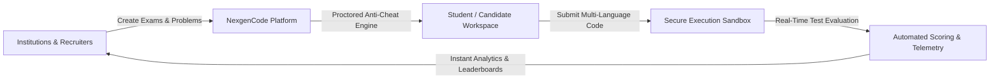
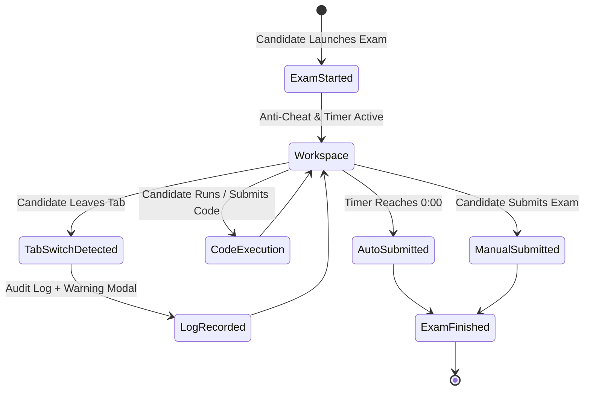
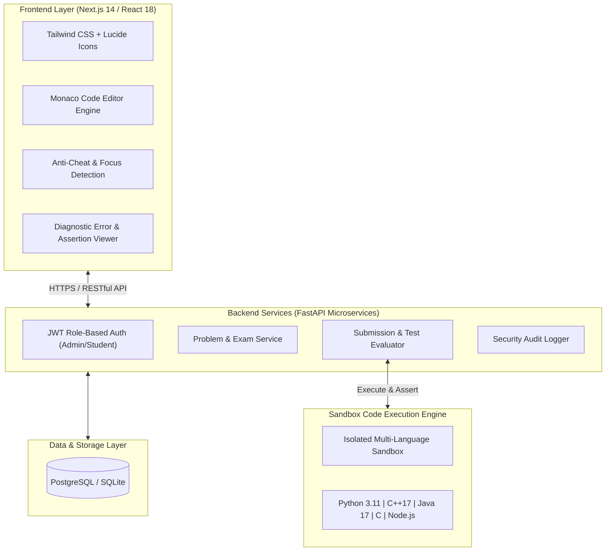

# NexgenCode — Enterprise Coding Assessment & Anti-Cheat Examination Platform
*Executive Client Presentation & Technical Overview Document*

---

## 1. Executive Summary

**NexgenCode** is an enterprise-grade, cloud-native automated coding assessment, learning, and examination platform designed for **Universities, EdTech Institutions, Coding Bootcamps, and Enterprise Talent Recruitment Teams**.

The platform provides an end-to-end ecosystem where educators and hiring managers can conduct secure, proctored coding assessments, while candidates and students can practice algorithmic problem-solving with instant compiler feedback, syntax diagnostics, and test case validations.

---

## 2. Key Business Value & Return on Investment (ROI)

| Challenge in Traditional Assessments | NexgenCode Solution | Client ROI & Impact |
| :--- | :--- | :--- |
| **Manual Evaluation Bottleneck** | Instant automated compilation, test execution, and grading across 5 major languages. | **95% reduction** in grading time and operational turnaround. |
| **Academic & Interview Cheating** | Hardened anti-cheat engine: Copy/Paste blocking, tab-switch monitoring, automated audit logging. | Guarantees **assessment integrity** and authentic candidate evaluation. |
| **High Infrastructure Costs** | Optimized lightweight static export architecture with low-latency backend microservices. | **Zero-Docker client requirement**; deployable on standard cloud or edge CDNs. |
| **Poor Candidate Experience** | Monaco Editor (VS Code engine), intelligent compiler diagnostic parser, and test diff visualizer. | Seamless, modern developer experience boosting engagement. |

---

## 3. Core Product Modules

### 3.1 Student Practice & Problem Solving Hub
- **Extensive Problem Catalog**: Algorithmic problem library categorized by topic (Arrays, Dynamic Programming, Graphs, Math) and difficulty level (Easy, Medium, Hard).
- **Embedded Monaco Editor**: Powered by the same engine as Microsoft VS Code with custom themes, syntax highlighting, and auto-formatting.
- **Multi-Language Support**:
  - Python 3.11
  - C++17 (GCC 11)
  - Java 17 (OpenJDK)
  - C (GCC 11)
  - JavaScript (Node.js 18)
- **Intelligent Error & Syntax Diagnostic Engine**:
  - Automatically classifies `SyntaxError`, `IndentationError`, `Compilation Error`, `Runtime Exceptions`, `Time Limit Exceeded (TLE)`, and `Wrong Answer`.
  - Pinpoints the exact **Line & Column** number in the code.
  - Generates **Smart Fix Recommendations (💡)** guiding students to fix missing colons, indentation errors, or unhandled null pointers.
- **Interactive Test Case Assertions**:
  - Side-by-side **Input**, **Expected Output**, and **Your Actual Output** comparison tabs (`Case 1`, `Case 2`, etc.).
  - Real-time execution time (ms) and memory usage (KB) metrics.
- **Submission History**: Complete timeline snapshots of previous code attempts and pass percentages.

---

### 3.2 Secure Examination & Anti-Cheat Workspace
Designed for formal high-stakes university semester exams and corporate recruitment screening:
- **Time-Bound Countdown Timer**: Synchronized server-side countdown with automatic submission upon timer expiration.
- **Comprehensive Anti-Cheating Suite**:
  - **Copy / Paste Disabled**: Deep Monaco and DOM-level keybinding interception blocking `Ctrl+V`, `Cmd+V`, `Shift+Insert`, `Ctrl+C`, `Ctrl+X`, and drag-and-drop.
  - **Context Menu Blocked**: Disables browser right-click inspect and menu copying.
  - **Tab Switching & Focus Loss Detection**: Tracks when a candidate switches tabs or minimizes the window, incrementing audit logs and displaying warning overlays.
  - **Text Selection Prevention**: Question descriptions have protected text selection to prevent OCR / clipboard extraction.
- **Multi-Question Navigation**: Seamless question switcher (`Q1`, `Q2`, `Q3`) with per-problem status pills (*Solved*, *Attempted*, *Unattempted*).

---

### 3.3 Admin Portal & Live Examination Operations
- **Live Submission Tracker**: 3-second real-time streaming polling that tracks student submissions as they happen live during exams.
- **Comprehensive KPI Dashboard**: Total submissions, real-time acceptance rates, error categorizations, and system uptime.
- **Exam & Problem Management**: Rich authoring tools to create problems, define constraints, and configure both public example test cases and hidden evaluation test cases.
- **Student Roster & Scorecards**: Student directory with progress tracking and performance history.
- **Data Export & Reporting**: One-click **CSV/Excel Export** of student marks, exam results, and submission audit trails.

---

## 4. Technical Architecture & Technology Stack

### Technical Stack Details:
- **Frontend Architecture**: Next.js 14 App Router, React 18, Tailwind CSS, Monaco Editor (`@monaco-editor/react`), Lucide React.
- **Backend Framework**: Python FastAPI with high-concurrency asynchronous handlers and JWT authentication.
- **Execution Sandbox Engine**: Isolated sandboxing with remote compilation capabilities (Piston / Judge0 / Containerized runner) providing millisecond-level execution benchmarking.
- **Deployment Compatibility**: Built with Next.js static export compatibility (`output: 'export'`), enabling zero-Docker hosting on **Vercel, Render, AWS S3/CloudFront, Cloudflare Pages, Apache, or Nginx**.

---

## 5. Security & Academic Integrity Safeguards

1. **Clipboard Security**:
   - Overrides Monaco keyboard commands (`Ctrl+V`, `Cmd+V`, `Ctrl+C`, `Ctrl+X`, `Shift+Insert`, `Ctrl+Insert`).
   - Nullifies Monaco internal clipboard actions (`clipboardPasteAction`, `clipboardCopyAction`).
   - Attaches capture-phase event listeners on DOM nodes and mutation-monitored `<textarea class="inputarea">` elements.
2. **Tab Visibility Monitoring**:
   - Uses the HTML5 `visibilitychange` API to record every window blur event with timestamps and violation counts.
3. **Sandbox Isolation**:
   - Executes candidate code in an isolated environment with strict resource limits (Time Limit: 2s, Memory Limit: 256MB) preventing network access, file system tampering, or fork bombs.

---

## 6. Summary for Client Presentation

> [!TIP]
> **NexgenCode** provides an all-in-one, highly scalable, and cost-effective solution for any organization that needs to evaluate programming skills accurately, securely, and without manual grading overhead.

### Next Steps for Implementation:
- **Live Demo & Test Drive**: Access candidate exam simulation and admin analytics dashboard.
- **Custom Integration**: Single Sign-On (SSO) integration with institutional LMS (Canvas, Moodle, Google Classroom) or HR ATS systems.
- **Tailored Problem Banks**: Curate custom algorithmic and domain-specific assessment libraries.
